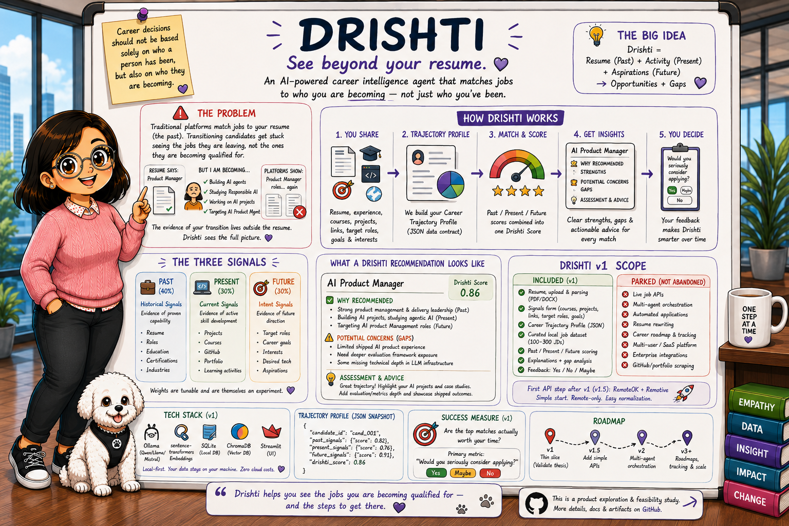

# Drishti — AI Career Intelligence Agent
### *See beyond your resume.*

> **Drishti** (Sanskrit: *vision, insight*) matches people to who they're **becoming** — not just who they've been.

An AI career-matching agent built on one thesis: career decisions shouldn't rest only on your *past* (a resume), but on your **trajectory** — where you are now and where you're headed.

---

## The problem
Job platforms match resumes to jobs by keyword — your *past*. So people **in transition** get recommended the job they're *leaving*, not the one they're becoming qualified for.

*Example: a Product Manager who's building AI apps, studying agentic AI, and targeting AI Product Management keeps getting shown PM roles forever. The transition is invisible to the machine, because the evidence lives outside the resume.*

## Two streams that never talk

- **Coursera & learning platforms** tell you *what to learn* to reach your goals — **future-facing.**
- **LinkedIn & job boards** match you to jobs from your *resume* — **past-facing.**

Neither connects the two. And the proof of who you're *becoming* — your **GitHub, projects, courses, blogs, portfolio** — lives outside the resume, where no job engine reads it.

**Drishti merges both streams** — matching you to opportunities on your *trajectory*, not your keywords.

## The thesis
**Drishti Score = Past (0.4) + Present (0.3) + Future (0.3)**

| Signal | Evidence of | Examples |
|---|---|---|
| **Past** | proven capability | resume, roles, certifications |
| **Present** | active development | projects, courses, GitHub, portfolio |
| **Future** | direction | target roles, goals, interests |

Every recommendation is **explained** — strengths, gaps, and one line of actionable advice — not just a number. *(Weights are tunable, and themselves an experiment.)*

## v1 — a deliberately thin slice
A local-first, single-user proof that trajectory-aware matching beats keyword search:

- Resume upload + a short **signals form** → a structured **Career Trajectory Profile** (JSON)
- A curated **local job dataset** (100–300 JDs in 1–2 domains)
- **Past / Present / Future** scoring → Drishti Score → ranked top 5–10, each with **WHY → CONCERNS → ASSESSMENT**
- Feedback capture: *"Would you seriously consider applying?"*

**Parked, not abandoned (out of v1):** live job APIs, multi-agent orchestration, auto-apply, resume rewriting, roadmap generation.

## Tech
Python · Streamlit · Ollama (Qwen 2.5) · BGE-small / MiniLM embeddings · ChromaDB · SQLite — **local-first, free/open-source.**

## Evaluation *(part of the product)*
- **Diversity metric** — % of matches keyword search would *not* surface (target ≥ 30%) → directly tests the thesis
- Recommendation approval ≥ 70% · would-apply rate ≥ 50% · **hallucination < 1%** · latency < 10s

Golden data, honest misses, published results.

## Status
Discovery complete · **PRD v1** · Phase A in progress.
Full detail → [`Drishti_PRD_v1.md`](Drishti_PRD_v1.md)

---

*Built by Ushasree Jakilinki — on a problem I'm living. · github.com/auj012*
